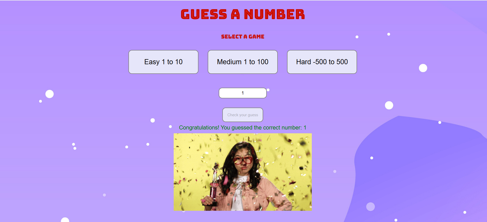

# Guess a number
## How it works
The computer will think of a random number depending on which button you clicked, and ask you to guess it. The computer will tell you if each guess is too high or too low. You win if you can guess the number.

This is a good game to code because it uses random numbers and input from the user in a short program. 

### Screenshot from the game
